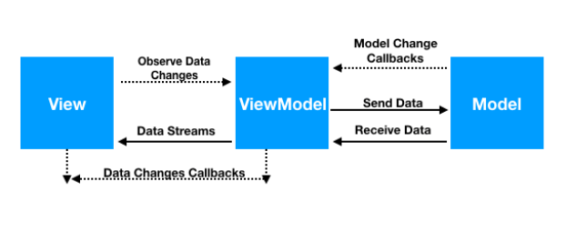

# Flutter GetX Template (GetX, Dio)

A Flutter GetX template using MVVM (Model View ViewModel) pattern. Dependency injected by GetX
and Dio used for network call. Here Get CLI used to create this project. 

## How to Build the project?
- Create two configurations `main_dev` and `main_prod`

## How was this project developed?
- Run [get cli](https://pub.dev/packages/get_cli) command to create project in the required directory: `get create project`
- Create `main_view` by running this command: `get create page:main` and so on...

## How to configure and run this project?

<b>Step 1:</b> First of all click "Edit Configurations" as like image 1:

<b>Step 2:</b> Choose "Flutter" from configuration list and select your Dart entrypoint path according
to your flavor then give a name and allow dart support for this project. See on Image 2, 3 and 4:

N.B: In this step you may need to setup your dart sdk path. If you get warned for 
"dart sdk not found in specified location" then just click on "fix" and select your dart sdk path.

## What is MVVM (Model View ViewModel) architectural pattern?
MVVM (Model View ViewModel) is a most popular architectural pattern for Software development. Basically
this pattern separates User interface from business-logic and backend-logic so that User interface
is not dependent on any specific model platform. It's divided into three layers: Model layer, 
View layer and View model layer. Let's explore it more deeply.

<b>ViewModel:</b> At first let's talk about ViewModel. Actually view model is a controller where we 
implement our business logics. It receives the data from the model and process the data according to
business logic and pushed into the live data observers which is observing by view.

<b>View:</b> View is the collections of widgets like Text, Image, Dropdown etc. Which will be displayed
to the users. Even it controls the user input. When it needs any data it command the view model (In this project it's controller)
for data and observe the response. Till then it may display a loader to the user.

<b>Model:</b> Model is basically backend logic. It controls the data source.

