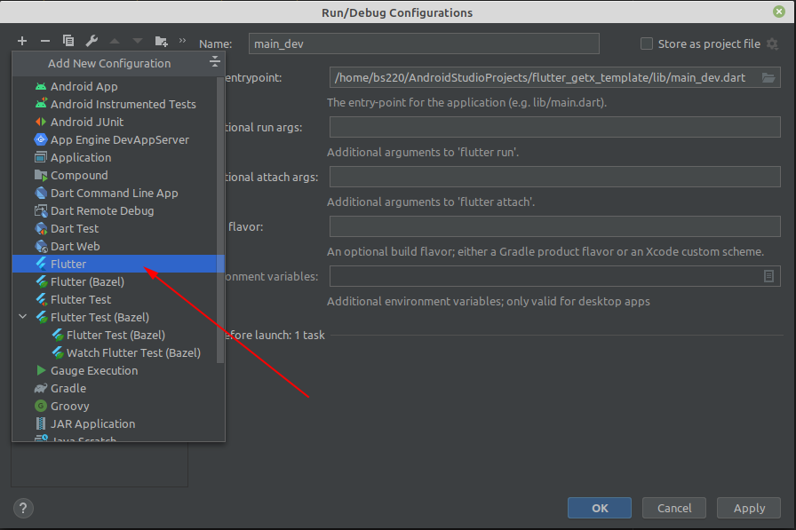
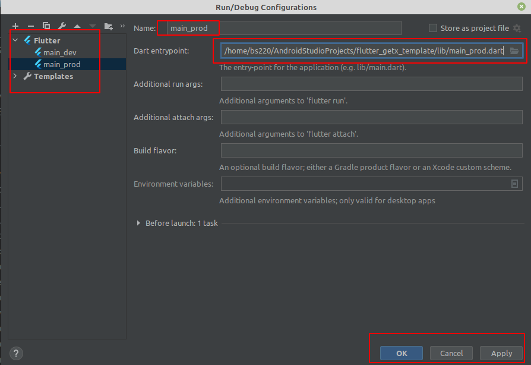

# Flutter GetX Template (GetX, Dio)

A Flutter GetX template using MVVM (Model View Viewmodel) pattern. Dependency injected by GetX
and Dio used for network call. Here Get CLI used to create this project. 

## How to Build the project?
- Create two configurations `main_dev` and `main_prod`

## How was this project developed?
- Run this command to create project in the required directory: `get create project`
- Create `main_view` by running this command: `get create page:main`

## How to configure and run this project?

<b>Step 1:</b> At first click "Edit Configurations" as like image 1:

<b>Step 2:</b> Choose "Flutter" from configuration list and select your Dart entrypoint path according
to your flavor then give a name and allow dart support for this project. See on Image 2, 3 and 4:

N.B: In this step you may need to setup your dart sdk path. If you get warned for 
"dart sdk not found in specified location" then just click on "fix" and select your dart sdk path.

