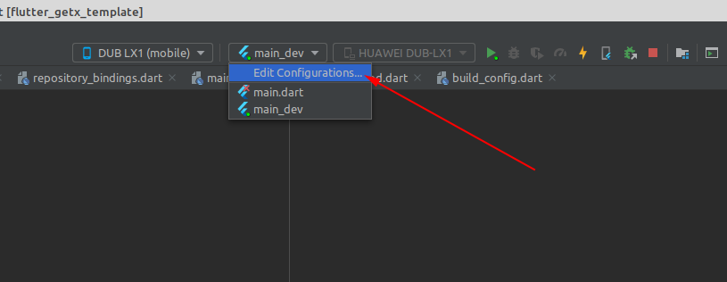
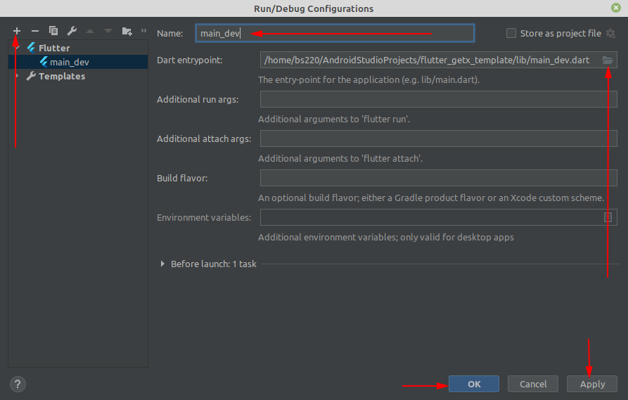

# How to configure and run this project?

**Step 1:** First of all click "Add/Edit Configurations" as like image 1:



**Step 2:** Choose "Flutter" from configuration list and select your Dart entrypoint path according
to your flavor then give a name and allow dart support for this project. See on Image 2, 3 and 4:




**Step 3:** Create another configuration for prod following two steps above:


N.B: In this step you may need to setup your dart sdk path. If you get warned for 
"dart sdk not found in specified location" then just click on "fix" and select your dart sdk path.

# How to configure and make android release build for production
Release build can be made using `flutter build <options> apk` command. Before that create a **key.properties** file in the **android** folder. Add folloiwng lines to that file:
```
keyAlias=<your keystore alias>
password=<your keystore password>
storeFile=<path to the keystore file>
```
Then run `flutter build appbundle -t lib/main_prod.dart --flavor prod` to generate app bundle (.aab) file. To generate .apk file, run `flutter build apk -t lib/main_prod.dart --flavor prod`.

For more details, please read through guide to build and relase android app documentation from [this link](https://docs.flutter.dev/deployment/android).